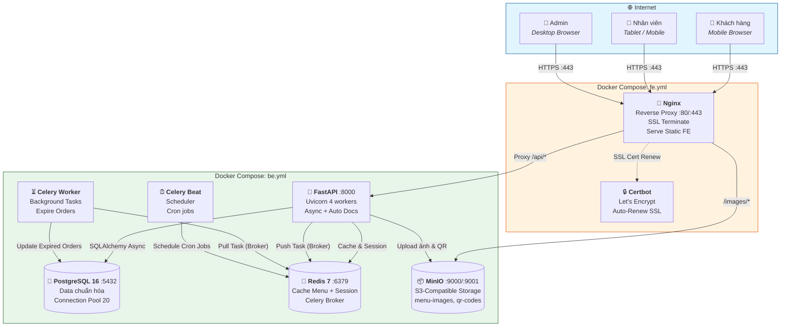
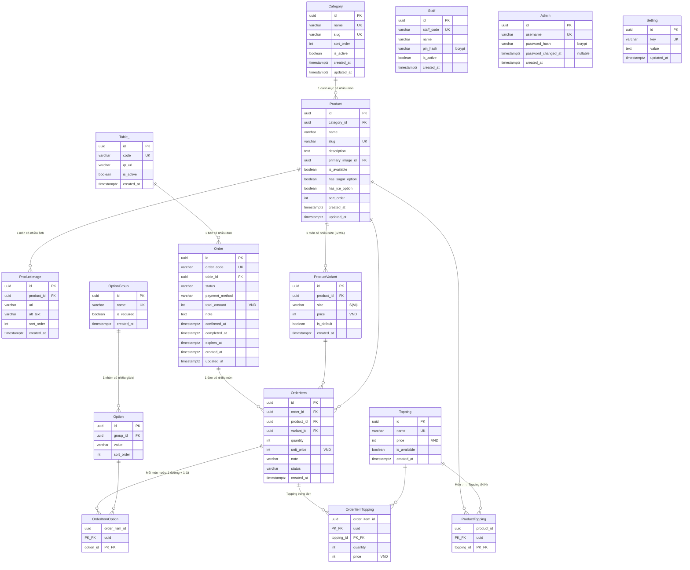
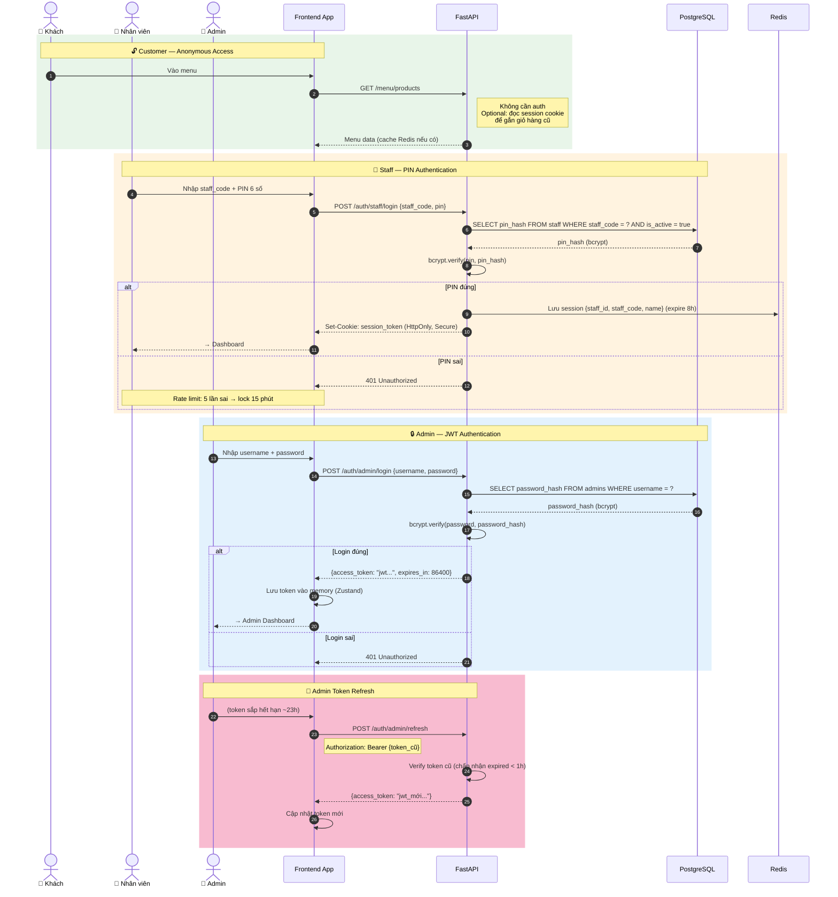
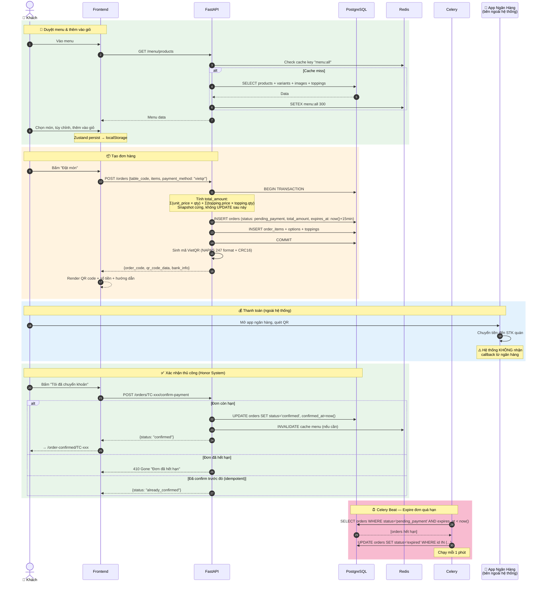
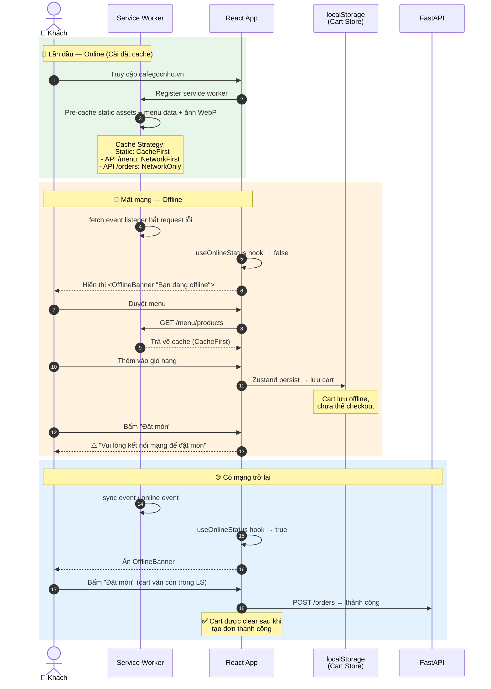
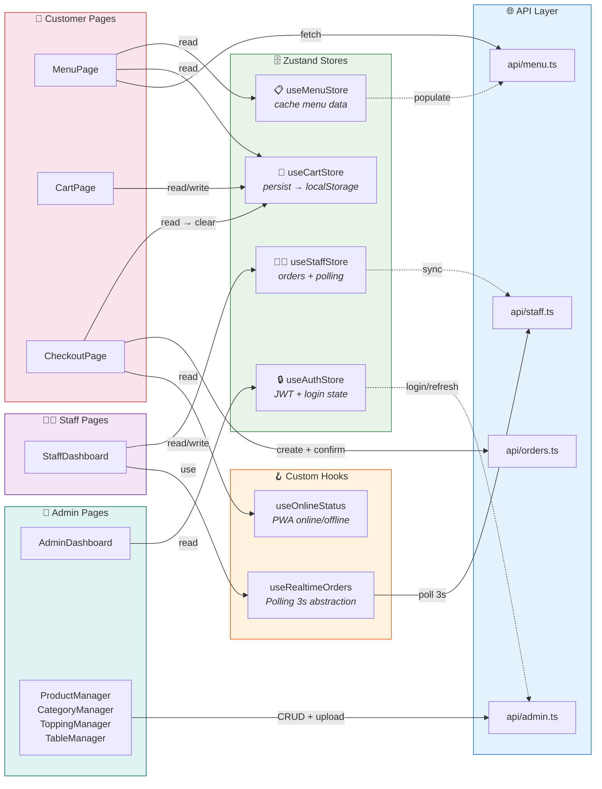
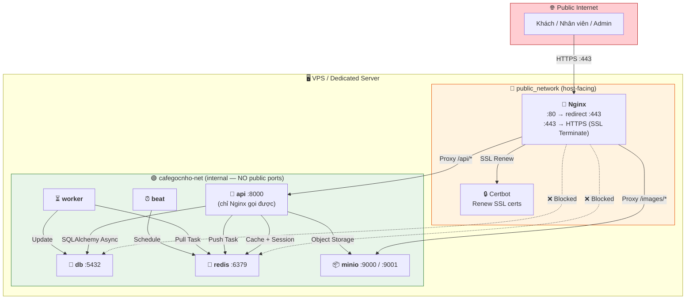

# Technical Design Document — Tiệm Cafe Góc Nhỏ

> **Version:** 2.0 · **Ngày:** 2026-07-12 · **Author:** Claude
> **Status:** Final
> **PRD reference:** [docs/PRD.md](PRD.md)

---

## 1. Overview

### Bài toán

Khách vào quán cafe giờ cao điểm phải chờ nhân viên ra order, dễ gọi nhầm món (sai size, quên đường/đá). Quán nhỏ không có POS chuyên nghiệp, nhân viên không kịp ghi chép và tính tiền chính xác. Chủ quán không có công cụ quản lý menu, không biết món nào bán chạy.

### Giải pháp

Web App PWA mở trực tiếp trên trình duyệt điện thoại. Khách quét mã QR trên bàn → vào menu trực quan → chọn món & tùy chỉnh (size/đường/đá/topping) → thanh toán qua VietQR → nhân viên nhận order ngay trên dashboard. Không cần tải app, không cần đăng ký.

### Scope của TDD này

Bao gồm toàn bộ system: Menu công khai, Order & thanh toán VietQR, Dashboard nhân viên (PIN auth), Admin quản lý menu/bàn/nhân viên, PWA offline. **Không bao gồm:** Tài khoản khách hàng, tích điểm loyalty, đặt trước, báo cáo doanh thu, AI gợi ý món, WebSocket.

### Quyết định kiến trúc quan trọng

- **SPA React + FastAPI tách riêng** thay vì Next.js monolith → FE và BE deploy độc lập, scale riêng, team có thể phân công Frontend/Backend riêng
- **PostgreSQL + SQLAlchemy 2.0 async** thay vì MongoDB → data có quan hệ phức tạp (Product-Variant-Option-Order), cần transaction ACID cho đơn hàng
- **Polling 3s + abstraction hook** thay vì WebSocket → MVP nhanh hơn, không cần WebSocket infra; hook `useRealtimeOrders` abstraction để swap WebSocket sau không đụng component
- **MinIO self-hosted** thay vì AWS S3 → không phụ thuộc cloud, S3-compatible API nên migrate lên AWS S3 không sửa code
- **VietQR tự generate (toán học CRC16)** thay vì gọi API bên thứ 3 → không tốn phí, không phụ thuộc dịch vụ ngoài, offline-ready

> **Tại sao chọn các quyết định này:** Mỗi quyết định đánh đổi giữa tốc độ MVP và khả năng mở rộng sau. Polling thay WebSocket, MinIO thay S3, VietQR tự generate — tất cả đều tránh phụ thuộc bên thứ 3, giữ chi phí vận hành ~0đ ngoài tiền VPS.

---

## 2. System Architecture

### 2.1 High-level diagram (C4 Container)



### 2.2 Các thành phần chính

| Component | Vai trò | Tech | Tại sao chọn |
|---|---|---|---|
| **Web App (FE)** | UI cho khách xem menu, đặt món, thanh toán | React 18 + Vite + TailwindCSS + shadcn/ui | Vite build nhanh, SPA tối ưu cho mobile, shadcn/ui copy-paste không lock-in |
| **API Server** | REST API xử lý business logic | FastAPI (Python 3.11+) + Uvicorn | Async-native, auto OpenAPI docs, Pydantic validation |
| **API Pagination** | Phân trang chuẩn cho list endpoints | `fastapi-pagination` | Tích hợp sẵn SQLAlchemy async, auto OpenAPI docs, cursor + offset pagination |
| **Database** | Lưu toàn bộ data nghiệp vụ | PostgreSQL 16 + SQLAlchemy 2.0 async | ACID cho đơn hàng, quan hệ phức tạp, Alembic migrate |
| **Cache + Broker** | Cache menu + session + Celery broker | Redis 7 | 1 service làm 3 việc, giảm infrastructure complexity |
| **Task Queue** | Background jobs (expire orders, dọn dẹp) | Celery + Celery Beat | Tách biệt xử lý nền, không block request chính |
| **File Storage** | Lưu ảnh menu + QR code | MinIO (S3-compatible) | Tự host, S3 API → migrate lên AWS không cần sửa code |
| **Reverse Proxy** | Serve static FE, proxy API, terminate SSL | Nginx + Certbot (Let's Encrypt) | 1 entry point ra internet, tăng security |
| **Thanh toán** | Sinh mã VietQR | `qrcode` + `Pillow` (CRC16) | Thuần toán học, không gọi API ngoài |

> **Tại sao chọn kiến trúc này:** Tách FE/BE thành 2 Docker Compose file riêng — FE (Nginx + Certbot) có thể deploy trên VPS nhẹ, BE (FastAPI + DB + Redis + MinIO + Celery) cần nhiều tài nguyên hơn. Internal network `cafegocnho-net` đảm bảo chỉ Nginx exposed ra internet, tất cả service khác giao tiếp nội bộ.

### 2.3 Deployment topology

```
VPS / Dedicated Server (Ubuntu 22.04)
│
├── Docker Compose: fe.yml
│   ├── Nginx (port 80:80, 443:443)   ← Reverse proxy + SSL terminate
│   └── Certbot                        ← Auto-renew SSL (cron mỗi 12h)
│
├── Docker Compose: be.yml
│   ├── FastAPI (port 8000)            ← Uvicorn 4 workers
│   ├── Celery Worker                  ← Background tasks
│   ├── Celery Beat                    ← Scheduler (cron jobs)
│   ├── PostgreSQL (port 5432)         ← Data persistence
│   ├── Redis (port 6379)              ← Cache + Session + Broker
│   └── MinIO (port 9000, 9001)        ← Object storage
│
└── Shared Docker Network: cafegocnho-net (internal, bridge)
```

### 2.4 Docker Compose structure

**docker-compose.fe.yml** — Frontend + Nginx + Certbot:

```yaml
version: '3.8'
services:
  frontend:
    build:
      context: ./frontend
      dockerfile: Dockerfile
      target: production
    container_name: cafegocnho-fe
    ports:
      - "80:80"
      - "443:443"
    volumes:
      - ./nginx/conf.d:/etc/nginx/conf.d:ro
      - ./certbot/conf:/etc/letsencrypt:ro
      - ./certbot/www:/var/www/certbot:ro
    networks:
      - cafegocnho-net
    restart: unless-stopped

  certbot:
    image: certbot/certbot:latest
    container_name: cafegocnho-certbot
    volumes:
      - ./certbot/conf:/etc/letsencrypt
      - ./certbot/www:/var/www/certbot
    entrypoint: "/bin/sh -c 'trap exit TERM; while :; do certbot renew; sleep 12h & wait $${!}; done;'"
    networks:
      - cafegocnho-net

networks:
  cafegocnho-net:
    external: true
```

**docker-compose.be.yml** — Backend + DB + Redis + MinIO + Celery:

```yaml
version: '3.8'
services:
  api:
    build:
      context: ./backend
      dockerfile: Dockerfile
    container_name: cafegocnho-api
    command: uvicorn app.main:app --host 0.0.0.0 --port 8000
    environment:
      - DATABASE_URL=postgresql+asyncpg://user:pass@db:5432/cafegocnho
      - REDIS_URL=redis://redis:6379/0
      - MINIO_ENDPOINT=minio:9000
      - MINIO_ACCESS_KEY=${MINIO_ACCESS_KEY}
      - MINIO_SECRET_KEY=${MINIO_SECRET_KEY}
      - JWT_SECRET=${JWT_SECRET}
      - VIETQR_BANK_BIN=${VIETQR_BANK_BIN}
      - VIETQR_ACCOUNT_NO=${VIETQR_ACCOUNT_NO}
      - VIETQR_ACCOUNT_NAME=${VIETQR_ACCOUNT_NAME}
    ports:
      - "8000:8000"
    depends_on:
      db:
        condition: service_healthy
      redis:
        condition: service_started
      minio:
        condition: service_started
    networks:
      - cafegocnho-net
    restart: unless-stopped

  worker:
    build:
      context: ./backend
      dockerfile: Dockerfile
    container_name: cafegocnho-worker
    command: celery -A app.tasks worker --loglevel=info
    environment:
      - DATABASE_URL=postgresql+asyncpg://user:pass@db:5432/cafegocnho
      - REDIS_URL=redis://redis:6379/0
    depends_on:
      - db
      - redis
    networks:
      - cafegocnho-net
    restart: unless-stopped

  beat:
    build:
      context: ./backend
      dockerfile: Dockerfile
    container_name: cafegocnho-beat
    command: celery -A app.tasks beat --loglevel=info
    environment:
      - DATABASE_URL=postgresql+asyncpg://user:pass@db:5432/cafegocnho
      - REDIS_URL=redis://redis:6379/0
    depends_on:
      - db
      - redis
    networks:
      - cafegocnho-net
    restart: unless-stopped

  db:
    image: postgres:16-alpine
    container_name: cafegocnho-db
    environment:
      - POSTGRES_USER=user
      - POSTGRES_PASSWORD=${DB_PASSWORD}
      - POSTGRES_DB=cafegocnho
    volumes:
      - pgdata:/var/lib/postgresql/data
    ports:
      - "5432:5432"
    healthcheck:
      test: ["CMD-SHELL", "pg_isready -U user -d cafegocnho"]
      interval: 5s
      timeout: 5s
      retries: 5
    networks:
      - cafegocnho-net
    restart: unless-stopped

  redis:
    image: redis:7-alpine
    container_name: cafegocnho-redis
    volumes:
      - redisdata:/data
    networks:
      - cafegocnho-net
    restart: unless-stopped

  minio:
    image: minio/minio:latest
    container_name: cafegocnho-minio
    command: server /data --console-address ":9001"
    environment:
      - MINIO_ROOT_USER=${MINIO_ACCESS_KEY}
      - MINIO_ROOT_PASSWORD=${MINIO_SECRET_KEY}
    volumes:
      - miniodata:/data
    ports:
      - "9000:9000"
      - "9001:9001"
    networks:
      - cafegocnho-net
    restart: unless-stopped

volumes:
  pgdata:
  redisdata:
  miniodata:

networks:
  cafegocnho-net:
```

---

## 3. Data Model

### 3.1 Entity Relationship Diagram (Mermaid)



> **Tại sao chọn data model chuẩn hóa (3NF):** Product tách khỏi Variant và Option — cho phép thêm size mới không cần sửa code, query báo cáo sau này không cần parse JSON. Composite PK cho bảng join (ProductTopping, OrderItemOption, OrderItemTopping) đảm bảo không duplicate. Tất cả khóa chính dùng UUID để tránh đoán được ID khi lộ URL.

### 3.2 Entity relationship overview (Text)

```
Category (1) ──┬── (N) Product (1) ──── (N) ProductVariant (variant per size)
               │        │                        │
               │        │ (N)                    │ (1)
               │        │                        │
               │        ├── (N) ProductTopping ──┤
               │        │         │              │
               │        │         └── (N) Topping
               │        │
               │        └── (N) ProductImage
               │
               └── (N) Product


OptionGroup (1) ──── (N) Option (sugar levels, ice levels)
  - "Đường": [0%, 30%, 50%, 70%, 100%]
  - "Đá":   [Không đá, Ít đá, Bình thường]


Table (1) ──── (N) Order (1) ──── (N) OrderItem
                                       │
                                       ├── (N) OrderItemOption (sugar, ice)
                                       │
                                       └── (N) OrderItemTopping


Staff (PIN auth)    — đăng nhập bằng staff_code + PIN 6 số
Admin (JWT auth)    — đăng nhập bằng username + password
Setting (key-value) — cấu hình quán (tên, SĐT, địa chỉ, thông tin NH)
```

### 3.3 Schema chi tiết

#### `categories` — Danh mục món

| Column | Type | Constraints | Notes |
|---|---|---|---|
| `id` | `UUID` | PK, default `gen_random_uuid()` | |
| `name` | `VARCHAR(100)` | NOT NULL, UNIQUE | "Cà phê", "Trà", "Sinh tố" |
| `slug` | `VARCHAR(100)` | NOT NULL, UNIQUE | `ca-phe`, `tra` |
| `sort_order` | `INTEGER` | NOT NULL, DEFAULT 0 | Thứ tự hiển thị tab |
| `is_active` | `BOOLEAN` | NOT NULL, DEFAULT TRUE | Ẩn/hiện danh mục |
| `created_at` | `TIMESTAMPTZ` | NOT NULL, DEFAULT NOW() | |
| `updated_at` | `TIMESTAMPTZ` | NOT NULL, DEFAULT NOW() | ON UPDATE trigger |

#### `products` — Món

| Column | Type | Constraints | Notes |
|---|---|---|---|
| `id` | `UUID` | PK | |
| `category_id` | `UUID` | FK → categories.id, NOT NULL | |
| `name` | `VARCHAR(200)` | NOT NULL | "Cà phê sữa" |
| `slug` | `VARCHAR(200)` | NOT NULL, UNIQUE | `ca-phe-sua` |
| `description` | `TEXT` | | Mô tả 1-2 dòng |
| `primary_image_id` | `UUID` | FK → product_images.id, nullable | Ảnh đại diện |
| `is_available` | `BOOLEAN` | NOT NULL, DEFAULT TRUE | Còn hàng / Hết hàng |
| `has_sugar_option` | `BOOLEAN` | NOT NULL, DEFAULT TRUE | Món nước → true, bánh → false |
| `has_ice_option` | `BOOLEAN` | NOT NULL, DEFAULT TRUE | Món nước → true, bánh → false |
| `sort_order` | `INTEGER` | NOT NULL, DEFAULT 0 | |
| `created_at` | `TIMESTAMPTZ` | NOT NULL, DEFAULT NOW() | |
| `updated_at` | `TIMESTAMPTZ` | NOT NULL, DEFAULT NOW() | |

#### `product_images` — Ảnh món

| Column | Type | Constraints | Notes |
|---|---|---|---|
| `id` | `UUID` | PK | |
| `product_id` | `UUID` | FK → products.id, NOT NULL | |
| `url` | `VARCHAR(500)` | NOT NULL | MinIO object URL |
| `alt_text` | `VARCHAR(200)` | | Text cho accessibility |
| `sort_order` | `INTEGER` | NOT NULL, DEFAULT 0 | |
| `created_at` | `TIMESTAMPTZ` | NOT NULL, DEFAULT NOW() | |

#### `product_variants` — Biến thể theo size

| Column | Type | Constraints | Notes |
|---|---|---|---|
| `id` | `UUID` | PK | |
| `product_id` | `UUID` | FK → products.id, NOT NULL | |
| `size` | `VARCHAR(10)` | NOT NULL | "S", "M", "L" |
| `price` | `INTEGER` | NOT NULL | 30000, 35000, 40000 (VND) |
| `is_default` | `BOOLEAN` | NOT NULL, DEFAULT FALSE | Size mặc định khi chọn món |
| `created_at` | `TIMESTAMPTZ` | NOT NULL, DEFAULT NOW() | |

> **Unique constraint:** `(product_id, size)` — mỗi món mỗi size chỉ có 1 giá

#### `toppings` — Topping

| Column | Type | Constraints | Notes |
|---|---|---|---|
| `id` | `UUID` | PK | |
| `name` | `VARCHAR(100)` | NOT NULL, UNIQUE | "Trân châu đen", "Kem béo" |
| `price` | `INTEGER` | NOT NULL | 7000 (VND) — giá cố định cho mọi topping |
| `is_available` | `BOOLEAN` | NOT NULL, DEFAULT TRUE | |
| `created_at` | `TIMESTAMPTZ` | NOT NULL, DEFAULT NOW() | |

#### `product_toppings` — Quan hệ Món ↔ Topping

| Column | Type | Constraints | Notes |
|---|---|---|---|
| `product_id` | `UUID` | FK → products.id, NOT NULL | |
| `topping_id` | `UUID` | FK → toppings.id, NOT NULL | |

> **PK:** `(product_id, topping_id)` — composite primary key

#### `option_groups` — Nhóm tùy chọn

| Column | Type | Constraints | Notes |
|---|---|---|---|
| `id` | `UUID` | PK | |
| `name` | `VARCHAR(50)` | NOT NULL, UNIQUE | "Đường", "Đá" |
| `is_required` | `BOOLEAN` | NOT NULL, DEFAULT TRUE | |
| `created_at` | `TIMESTAMPTZ` | NOT NULL, DEFAULT NOW() | |

> **Seeded data:** 2 rows — "Đường" và "Đá" (mở rộng thêm nhóm sau nếu cần)

#### `options` — Giá trị tùy chọn

| Column | Type | Constraints | Notes |
|---|---|---|---|
| `id` | `UUID` | PK | |
| `group_id` | `UUID` | FK → option_groups.id, NOT NULL | |
| `value` | `VARCHAR(50)` | NOT NULL | "0%", "30%", "50%", "70%", "100%" |
| `sort_order` | `INTEGER` | NOT NULL, DEFAULT 0 | |

> **Seeded data:**
> - Nhóm "Đường": 100%, 70%, 50%, 30%, 0%
> - Nhóm "Đá": Bình thường, Ít đá, Không đá

#### `tables` — Bàn trong quán

| Column | Type | Constraints | Notes |
|---|---|---|---|
| `id` | `UUID` | PK | |
| `code` | `VARCHAR(10)` | NOT NULL, UNIQUE | "B01", "B02", "B03" |
| `qr_url` | `VARCHAR(500)` | | URL đến QR image trên MinIO |
| `is_active` | `BOOLEAN` | NOT NULL, DEFAULT TRUE | |
| `created_at` | `TIMESTAMPTZ` | NOT NULL, DEFAULT NOW() | |

#### `orders` — Đơn hàng

| Column | Type | Constraints | Notes |
|---|---|---|---|
| `id` | `UUID` | PK | |
| `order_code` | `VARCHAR(20)` | NOT NULL, UNIQUE | "TC-20260712-0001" |
| `table_id` | `UUID` | FK → tables.id, nullable | NULL nếu khách không quét QR |
| `status` | `VARCHAR(20)` | NOT NULL, DEFAULT 'pending_payment' | Enum: pending_payment, confirmed, preparing, completed, cancelled, expired |
| `payment_method` | `VARCHAR(20)` | NOT NULL, DEFAULT 'vietqr' | Enum: vietqr, cash |
| `total_amount` | `INTEGER` | NOT NULL | Tổng tiền (VND) — **snapshot cố định, tính 1 lần khi tạo đơn, không bao giờ UPDATE** |
| `note` | `TEXT` | | Ghi chú chung cho cả đơn |
| `confirmed_at` | `TIMESTAMPTZ` | | Thời điểm xác nhận thanh toán |
| `completed_at` | `TIMESTAMPTZ` | | Thời điểm hoàn thành |
| `expires_at` | `TIMESTAMPTZ` | NOT NULL | Tự động expire sau 15 phút |
| `created_at` | `TIMESTAMPTZ` | NOT NULL, DEFAULT NOW() | |
| `updated_at` | `TIMESTAMPTZ` | NOT NULL, DEFAULT NOW() | |

> **Index:** `idx_orders_status` trên `(status)` cho dashboard polling
> **Index:** `idx_orders_table_id` trên `(table_id)`
> **Index:** `idx_orders_expires_at` trên `(expires_at)` cho cron job expire

#### `order_items` — Món trong đơn

| Column | Type | Constraints | Notes |
|---|---|---|---|
| `id` | `UUID` | PK | |
| `order_id` | `UUID` | FK → orders.id, NOT NULL | |
| `product_id` | `UUID` | FK → products.id, NOT NULL | |
| `variant_id` | `UUID` | FK → product_variants.id, NOT NULL | Size đã chọn |
| `quantity` | `INTEGER` | NOT NULL, DEFAULT 1 | |
| `unit_price` | `INTEGER` | NOT NULL | Giá **variant (size)** tại thời điểm đặt — không bao gồm topping. Snapshot từ `product_variants.price` |
| `note` | `VARCHAR(100)` | | Ghi chú riêng cho món này |
| `status` | `VARCHAR(20)` | NOT NULL, DEFAULT 'pending' | Enum: pending, preparing, done |
| `created_at` | `TIMESTAMPTZ` | NOT NULL, DEFAULT NOW() | |

> **Index:** `idx_order_items_order_id` trên `(order_id)`

#### `order_item_options` — Tùy chọn đường/đá cho từng món

| Column | Type | Constraints | Notes |
|---|---|---|---|
| `order_item_id` | `UUID` | FK → order_items.id, NOT NULL | |
| `option_id` | `UUID` | FK → options.id, NOT NULL | |

> **PK:** `(order_item_id, option_id)` — mỗi món nước sẽ có tối đa 2 rows: 1 cho đường + 1 cho đá

#### `order_item_toppings` — Topping trong đơn

| Column | Type | Constraints | Notes |
|---|---|---|---|
| `order_item_id` | `UUID` | FK → order_items.id, NOT NULL | |
| `topping_id` | `UUID` | FK → toppings.id, NOT NULL | |
| `quantity` | `INTEGER` | NOT NULL, DEFAULT 1 | |
| `price` | `INTEGER` | NOT NULL | Giá **1 topping** tại thời điểm đặt — snapshot từ `toppings.price` |

> **PK:** `(order_item_id, topping_id)`
>
> **Công thức tính `total_amount`:**
> ```
> total_amount = Σ (order_items.unit_price × order_items.quantity)
>              + Σ (order_item_toppings.price × order_item_toppings.quantity)
> ```
> Tính 1 lần trong `order_service.create_order()` bằng Python, lưu snapshot cứng vào DB. Không ai được UPDATE cột này — đảm bảo audit trail chính xác kể cả khi giá variant/topping thay đổi sau này.

#### `staff` — Nhân viên (PIN auth cho dashboard)

| Column | Type | Constraints | Notes |
|---|---|---|---|
| `id` | `UUID` | PK | |
| `staff_code` | `VARCHAR(10)` | NOT NULL, UNIQUE | "NV01", "NV02" — dùng để login |
| `name` | `VARCHAR(100)` | NOT NULL | "Tú", "Lan" — hiển thị trên dashboard |
| `pin_hash` | `VARCHAR(128)` | NOT NULL | bcrypt hash của PIN 6 số |
| `is_active` | `BOOLEAN` | NOT NULL, DEFAULT TRUE | Soft delete khi nhân viên nghỉ |
| `created_at` | `TIMESTAMPTZ` | NOT NULL, DEFAULT NOW() | |

#### `admins` — Admin (JWT auth cho quản lý)

| Column | Type | Constraints | Notes |
|---|---|---|---|
| `id` | `UUID` | PK | |
| `username` | `VARCHAR(50)` | NOT NULL, UNIQUE | |
| `password_hash` | `VARCHAR(128)` | NOT NULL | bcrypt hash |
| `password_changed_at` | `TIMESTAMPTZ` | nullable | NULL = chưa đổi → redirect đổi mật khẩu |
| `created_at` | `TIMESTAMPTZ` | NOT NULL, DEFAULT NOW() | |

#### `settings` — Cấu hình quán (key-value)

| Column | Type | Constraints | Notes |
|---|---|---|---|
| `id` | `UUID` | PK | |
| `key` | `VARCHAR(100)` | NOT NULL, UNIQUE | "shop_name", "shop_phone", "bank_account_no"... |
| `value` | `TEXT` | NOT NULL | |
| `updated_at` | `TIMESTAMPTZ` | NOT NULL, DEFAULT NOW() | |

> **Seeded keys:** `shop_name`, `shop_phone`, `shop_address`, `bank_name`, `bank_bin`, `bank_account_no`, `bank_account_name`, `bank_branch`

### 3.4 Order & OrderItem State Machine

```mermaid
stateDiagram-v2
    direction LR

    state "pending_payment" as pp : ⏳ Chờ thanh toán
    state "confirmed" as cf : ✅ Đã xác nhận
    state "preparing" as pr : 👨‍🍳 Đang pha chế
    state "completed" as co : 🎉 Hoàn thành
    state "cancelled" as ca : ❌ Đã hủy
    state "expired" as ex : 🕐 Hết hạn

    [*] --> pp : Khách tạo đơn<br/><i>POST /orders</i>

    pp --> cf : Khách bấm "Đã chuyển khoản"<br/><i>POST /orders/{code}/confirm-payment</i>
    pp --> ex : Quá 15 phút không thanh toán<br/><i>Celery Beat cron job</i>

    cf --> pr : Nhân viên bấm "Bắt đầu làm"<br/><i>PATCH /staff/orders/{id}/status</i>
    cf --> ca : Nhân viên hủy đơn<br/><i>PATCH /staff/orders/{id}/status</i>

    pr --> co : Tất cả OrderItem → done<br/><i>PATCH /staff/orders/{id}/status</i>
    pr --> ca : Nhân viên hủy đơn<br/><i>PATCH /staff/orders/{id}/status</i>

    co --> [*]
    ca --> [*]
    ex --> [*]

    note right of pr
        <b>OrderItem states (trong đơn):</b>
        pending → preparing → done
        Nhân viên đánh dấu từng món riêng
        qua PATCH /staff/order-items/{id}/status
    end note
```



### 3.5 Order State Transition Matrix

| From → To | Trigger | Actor |
|---|---|---|
| `pending_payment` → `confirmed` | `POST /orders/{code}/confirm-payment` | Khách |
| `pending_payment` → `expired` | `Celery Beat` task sau 15 phút | System |
| `confirmed` → `preparing` | `PATCH /staff/orders/{id}/status` | Nhân viên |
| `confirmed` → `cancelled` | `PATCH /staff/orders/{id}/status` | Nhân viên |
| `preparing` → `completed` | Tự động khi tất cả `order_items.status = 'done'` | System |
| `preparing` → `cancelled` | `PATCH /staff/orders/{id}/status` | Nhân viên |

> **Quy tắc cứng:** Không thể chuyển `expired → confirmed`, `completed → preparing`, `cancelled → *`. Validate ở service layer + DB constraint.
>
> **Tiền mặt:** Khi `payment_method = cash`, nhân viên sẽ đổi trạng thái trực tiếp `pending_payment → confirmed` thay vì đợi khách confirm.

> **Tại sao chọn state machine tường minh thay vì soft delete:** Đơn hàng là core business object — mỗi trạng thái có business rule riêng (tự động expire, không cho sửa sau khi confirmed). State machine trong code + enum trong DB đảm bảo không ai vô tình UPDATE sai trạng thái.

---

## 4. API Design

### 4.1 Base URL & Auth

```
Base: https://cafegocnho.vn/api/v1
Auth method:
  - Khách: Không cần auth
  - Nhân viên: Session cookie (HttpOnly, Secure) từ PIN login
  - Admin: JWT Bearer token (Authorization: Bearer {token})
```

> **Tại sao chọn JWT cho Admin, Session cookie cho Staff:** Admin cần API access từ xa (sau này có thể có mobile app quản lý) → JWT stateless phù hợp. Staff chỉ dùng trên tablet trong quán → Session cookie đơn giản hơn, dùng Redis để quản lý session tập trung.

### 4.2 Authentication Flow



### 4.3 API Endpoints

#### Public — Khách hàng

| Method | Endpoint | Mô tả | Query Params |
|---|---|---|---|
| `GET` | `/menu/categories` | Danh sách danh mục đang active | — |
| `GET` | `/menu/products` | Danh sách món (filter, search, phân trang) | `?category_slug=ca-phe&search=sua&available_only=true&page=1&size=20` |
| `GET` | `/menu/products/{slug}` | Chi tiết 1 món (kèm variants, toppings, ảnh) | — |
| `POST` | `/orders` | Tạo đơn hàng mới | — (body: order data) |
| `GET` | `/orders/{order_code}` | Tra cứu đơn hàng (không cần auth) | — |
| `POST` | `/orders/{order_code}/confirm-payment` | Khách xác nhận "Đã chuyển khoản" (VietQR) | — |
| `POST` | `/orders/{order_code}/confirm-cash` | Khách xác nhận đặt món tiền mặt (status → confirmed luôn) | — |
| `GET` | `/tables/{code}` | Kiểm tra bàn tồn tại | — |

#### Staff (PIN auth required — Session cookie)

| Method | Endpoint | Mô tả |
|---|---|---|
| `POST` | `/auth/staff/login` | Đăng nhập bằng staff_code + PIN |
| `POST` | `/auth/staff/logout` | Đăng xuất, xóa session Redis |
| `GET` | `/staff/orders` | Danh sách order mới + đang làm (cursor-based: `?since=<ISO>&status=confirmed,preparing&size=50`) |
| `PATCH` | `/staff/orders/{order_id}/status` | Cập nhật trạng thái đơn |
| `PATCH` | `/staff/order-items/{item_id}/status` | Đánh dấu món đã làm xong |

#### Admin (JWT auth required — Bearer token)

| Method | Endpoint | Mô tả |
|---|---|---|
| `POST` | `/auth/admin/login` | Đăng nhập username/password |
| `POST` | `/auth/admin/refresh` | Refresh JWT token |
| `GET/POST/PUT/DELETE` | `/admin/categories` | CRUD danh mục |
| `GET/POST/PUT/DELETE` | `/admin/products` | CRUD món (GET hỗ trợ phân trang `?page=1&size=20`) |
| `PUT` | `/admin/products/{id}/toggle-available` | Bật/tắt "Còn hàng" |
| `GET/POST/PUT/DELETE` | `/admin/toppings` | CRUD topping |
| `GET/POST/PUT/DELETE` | `/admin/tables` | CRUD bàn |
| `POST` | `/admin/tables/{id}/generate-qr` | Sinh QR code cho 1 bàn |
| `POST` | `/admin/tables/generate-all-qr` | Sinh QR cho tất cả bàn |
| `GET` | `/admin/tables/download-qr` | Download zip tất cả QR |
| `GET` | `/admin/orders` | Danh sách tất cả đơn (filter: `?status=&payment_method=&table_code=&date_from=&date_to=`, sort: `?sort_by=created_at&order=desc`, phân trang: `?page=1&size=20`) |
| `POST` | `/admin/upload/image` | Upload ảnh lên MinIO |
| `GET/POST/PUT` | `/admin/staff` | CRUD nhân viên |
| `PUT` | `/admin/staff/{id}/reset-pin` | Reset PIN nhân viên |
| `GET/PUT` | `/admin/settings` | Đọc/cập nhật cấu hình quán |

### 4.4 Request/Response Examples

#### `POST /orders` — Tạo đơn hàng

**Request:**
```json
{
  "table_code": "B01",
  "payment_method": "vietqr",
  "items": [
    {
      "product_id": "uuid...",
      "variant_id": "uuid...",
      "quantity": 1,
      "options": [
        { "option_id": "uuid-of-50%-duong" },
        { "option_id": "uuid-of-it-da" }
      ],
      "toppings": [
        { "topping_id": "uuid...", "quantity": 1 }
      ],
      "note": "Pha hơi đậm giúp em"
    }
  ]
}
```

**Response (201):**
```json
{
  "order_code": "TC-20260712-0001",
  "total_amount": 45000,
  "qr_code_data": "000201010212...",
  "expires_at": "2026-07-12T14:30:00+07:00",
  "bank_info": {
    "bank_name": "VPBank",
    "account_no": "680180598",
    "account_name": "LUU VAN TU",
    "amount": 45000,
    "description": "TC-20260712-0001"
  }
}
```

#### `GET /staff/orders` — Dashboard polling

**Query:** `?since=2026-07-12T14:25:00+07:00&status=new,preparing`

**Response:**
```json
{
  "orders": [
    {
      "id": "uuid...",
      "order_code": "TC-20260712-0001",
      "table_code": "B01",
      "status": "confirmed",
      "payment_method": "vietqr",
      "total_amount": 45000,
      "created_at": "2026-07-12T14:25:30+07:00",
      "items": [
        {
          "id": "uuid...",
          "product_name": "Cà phê sữa",
          "variant": { "size": "M", "price": 35000 },
          "quantity": 1,
          "options": [
            { "group": "Đường", "value": "50%" },
            { "group": "Đá", "value": "Ít đá" }
          ],
          "toppings": [
            { "name": "Kem béo", "quantity": 1, "price": 7000 }
          ],
          "note": null,
          "status": "pending"
        }
      ]
    }
  ]
}
```

#### `POST /admin/upload/image` — Upload ảnh

**Request:** `multipart/form-data: file` (JPG/PNG/WebP, max 5MB)

**Response:**
```json
{
  "id": "uuid...",
  "url": "https://minio:9000/menu-images/xxx.webp",
  "original_name": "caphesua.jpg",
  "file_size": 45000
}
```

### 4.5 Pagination Strategy

> **Tại sao chọn `fastapi-pagination`:** Thư viện tích hợp sẵn với SQLAlchemy async, tự động generate OpenAPI docs cho page/size params, hỗ trợ cả offset và cursor pagination. Không cần tự viết boilerplate `LIMIT/OFFSET` hay `total_count` query.

Dùng 2 chiến lược khác nhau cho 2 loại endpoint:

| Loại | Cơ chế | Thư viện | Áp dụng cho | Lý do |
|---|---|---|---|---|
| **Offset-based** | `?page=1&size=20` | `fastapi-pagination` + `PaginatedParams` | `GET /admin/orders`, `GET /admin/products`, `GET /menu/products` | Admin cần nhảy trang, biết tổng số trang. Menu cần phân trang khi số món > 50. |
| **Cursor-based** | `?since=<ISO>&size=50` | Tự implement (dùng `updated_at` làm cursor) | `GET /staff/orders` | Dashboard polling — cursor-based đảm bảo không bỏ sót đơn mới insert giữa 2 lần poll, không duplicate. |

**Response format:**

```json
// Offset-based (fastapi-pagination)
{
  "items": [...],
  "total": 156,
  "page": 1,
  "size": 20,
  "pages": 8
}

// Cursor-based (staff dashboard — custom)
{
  "orders": [...],
  "next_cursor": "2026-07-12T15:30:00+07:00",
  "has_more": true
}
```

**Implementation với SQLAlchemy async:**

```python
# fastapi-pagination tự động xử lý page/size params + bọc response
from fastapi_pagination import Page, Params, paginate
from fastapi_pagination.ext.async_sqlalchemy import paginate as async_paginate

@router.get("/admin/orders", response_model=Page[OrderOut])
async def list_orders(
    db: AsyncSession = Depends(get_db),
    admin: dict = Depends(get_current_admin),
    params: Params = Depends(),  # tự động parse ?page=1&size=20
    status: str | None = None,
    date_from: date | None = None,
):
    query = select(Order).order_by(Order.created_at.desc())
    if status:
        query = query.where(Order.status == status)
    if date_from:
        query = query.where(func.date(Order.created_at) >= date_from)
    return await async_paginate(db, query, params)
```

**Tham số mặc định:**

| Param | Default | Max | Ghi chú |
|---|---|---|---|
| `page` | 1 | — | Offset-based |
| `size` | 20 | 100 | Chặn cứng ở backend, không cho query quá 100 rows/lần |
| `since` | — | — | ISO timestamp, cursor-based cho staff dashboard |
| `size` (cursor) | 50 | 100 | Số order tối đa mỗi lần poll |

---

## 5. Authentication & Authorization

### 5.1 Flow — Staff PIN Login

```
Nhân viên POST /auth/staff/login { staff_code, pin }
  → SELECT id, name, pin_hash FROM staff WHERE staff_code = ? AND is_active = true
  → Check Redis rate limit: nếu sai ≥ 5 lần trong 15 phút → 429
  → bcrypt.verify(pin, pin_hash)
  → Đúng: tạo session_token (UUID), lưu Redis {staff_id, staff_code, name} TTL 8h
  → Set-Cookie: session_token, HttpOnly, Secure, SameSite=Strict
  → Sai: INCR Redis counter, TTL 900s
```

### 5.2 Flow — Admin JWT Login

```
Admin POST /auth/admin/login { username, password }
  → SELECT id, password_hash, password_changed_at FROM admins WHERE username = ?
  → bcrypt.verify(password, password_hash)
  → Tạo JWT (HS256, secret từ JWT_SECRET env)
  → Return { access_token, expires_in: 86400, must_change_password }
```

### 5.3 JWT payload

```json
{
  "sub": "admin-uuid",
  "username": "admin",
  "role": "admin",
  "iat": 1720771200,
  "exp": 1720857600
}
```

### 5.4 Middleware auth (FastAPI dependencies)

```python
# app/auth/admin_auth.py
from fastapi import Depends, HTTPException
from fastapi.security import HTTPBearer, HTTPAuthorizationCredentials
import jwt

security = HTTPBearer()

async def get_current_admin(
    credentials: HTTPAuthorizationCredentials = Depends(security)
) -> dict:
    try:
        payload = jwt.decode(
            credentials.credentials,
            settings.JWT_SECRET,
            algorithms=["HS256"]
        )
        return payload
    except jwt.ExpiredSignatureError:
        raise HTTPException(status_code=401, detail="Token expired")
    except jwt.InvalidTokenError:
        raise HTTPException(status_code=401, detail="Invalid token")

# Usage in router:
@router.get("/admin/products")
async def list_products(admin: dict = Depends(get_current_admin)):
    ...
```

```python
# app/auth/staff_auth.py
from fastapi import Depends, HTTPException, Request
import uuid

async def get_current_staff(request: Request) -> dict:
    session_token = request.cookies.get("session_token")
    if not session_token:
        raise HTTPException(status_code=401, detail="Not authenticated")

    staff_data = await redis.get(f"staff_session:{session_token}")
    if not staff_data:
        raise HTTPException(status_code=401, detail="Session expired")

    return json.loads(staff_data)

# Usage in router:
@router.get("/staff/orders")
async def list_orders(staff: dict = Depends(get_current_staff)):
    ...
```

### 5.5 Rate limiting

```python
# app/middleware/rate_limit.py
# Customer: 5 POST /orders mỗi 5 phút mỗi IP
# Staff PIN: 5 lần sai mỗi 15 phút mỗi IP
# Cài đặt qua Redis INCR + EXPIRE
```

> **Tại sao chọn HS256 thay vì RS256:** MVP solo dev, 1 service duy nhất verify JWT → symmetric key đơn giản hơn asymmetric. Khi có nhiều service cần verify JWT thì nâng cấp lên RS256.

---

## 6. Data Flows — Các Luồng Chính

> **Tại sao cần data flow diagram:** Flow đặt món liên quan đến 4 systems (Frontend → FastAPI → PostgreSQL → Redis) — sequence diagram giúp thấy rõ transaction boundary, điểm có thể fail, và thứ tự xử lý.

### 6.1 Luồng 1: Khách đặt món + thanh toán VietQR



### 6.2 Luồng 2: Dashboard nhân viên (Polling)

```
┌────────────┐     ┌──────────┐     ┌──────────┐
│  Frontend  │     │  FastAPI │     │PostgreSQL│
│ (Dashboard)│     │          │     │          │
└─────┬──────┘     └────┬─────┘     └────┬─────┘
      │                 │               │
      │  POST /auth/staff/login {staff_code: "NV01", pin: "123456"}
      │────────────────▶│               │
      │                 │  SELECT staff WHERE staff_code = 'NV01' AND is_active = true
      │                 │──────────────▶│
      │  ◀──────────────│  Set-Cookie: session_token
      │                 │               │
      │  (setInterval 3000ms — useRealtimeOrders hook)     │
      │                 │               │
      │  GET /staff/orders?since=...&status=confirmed,preparing
      │────────────────▶│               │
      │                 │  SELECT orders WHERE updated_at > since
      │                 │  + JOIN order_items + options + toppings
      │                 │──────────────▶│
      │  ◀──────────────│  {orders: [...]}
      │                 │               │
      │  (Hiển thị order mới → cột "Mới")                │
      │  (Nhân viên bấm "Bắt đầu làm")  │               │
      │                 │               │
      │  PATCH /staff/orders/{id}/status {status: "preparing"}
      │────────────────▶│               │
      │                 │  UPDATE orders SET status='preparing'
      │                 │──────────────▶│
      │  ◀──────────────│  {ok: true}   │
      │                 │               │
      │  (Poll tiếp theo — order chuyển sang cột "Đang làm")
      │  (Nhân viên làm xong món → đánh dấu từng món)
      │                 │               │
      │  PATCH /staff/order-items/{id}/status {status: "done"}
      │────────────────▶│               │
      │                 │  UPDATE order_items SET status='done'
      │                 │──────────────▶│
      │  ◀──────────────│  {ok: true}   │
      │                 │               │
      │  (Tất cả món done → PATCH order status "completed")
      │  (Nhân viên mang nước ra bàn)    │
```

### 6.3 Luồng 3: Admin quản lý menu + upload ảnh

```
┌────────────┐     ┌──────────┐     ┌──────────┐     ┌──────────┐
│  Frontend  │     │  FastAPI │     │PostgreSQL│     │  MinIO   │
│ (Admin)    │     │          │     │          │     │          │
└─────┬──────┘     └────┬─────┘     └────┬─────┘     └────┬─────┘
      │                 │               │                │
      │  POST /auth/admin/login {username, password}
      │────────────────▶│               │                │
      │  ◀──────────────│  {access_token: "jwt..."}
      │                 │               │                │
      │  POST /admin/upload/image (multipart/form-data: file)
      │────────────────▶│               │                │
      │                 │  Validate: JPG/PNG/WebP, < 5MB│
      │                 │  Resize bằng Pillow (max 800px, WebP, quality 80)
      │                 │──────────────────────────────▶│
      │                 │  minio.put_object("menu-images", file)
      │                 │  ◀────────────────────────────│
      │  ◀──────────────│  {id, url: "https://minio:9000/menu-images/xxx.webp"}
      │                 │               │                │
      │  POST /admin/products {category_id, name, ..., image_ids: [...]}
      │────────────────▶│               │                │
      │                 │  INSERT product + variants + product_toppings
      │                 │──────────────▶│                │
      │                 │  INVALIDATE cache key menu:*   │
      │                 │───────────────│───────────────▶│
      │  ◀──────────────│  {product}    │  DEL menu:*    │
```

### 6.4 Luồng 4: PWA Offline → Online Sync



---

## 7. Frontend Architecture

### 7.1 Route Structure & Code Splitting

```
App Router (React Router v6)
├── /                           → MenuPage          (lazy load)
│   └── ?table=B01              → (param từ QR)
├── /cart                       → CartPage          (lazy load)
├── /checkout?order=TC-xxx      → CheckoutPage      (lazy load, đọc order_code từ query param)
├── /order-confirmed/:code      → OrderConfirmed    (lazy load)
├── /staff                      → StaffLogin        (lazy load)
│   └── /staff/dashboard        → StaffDashboard    (lazy load, PIN protected)
├── /admin                      → AdminLogin        (lazy load)
│   ├── /admin/dashboard        → AdminDashboard    (lazy load, JWT protected)
│   ├── /admin/categories       → CategoryManager   (lazy load)
│   ├── /admin/products         → ProductManager    (lazy load)
│   ├── /admin/toppings         → ToppingManager    (lazy load)
│   ├── /admin/tables           → TableManager      (lazy load)
│   ├── /admin/staff            → StaffManager      (lazy load)
│   ├── /admin/orders           → AdminOrders       (lazy load)
│   └── /admin/settings         → SettingsPage      (lazy load)
```

> **Tại sao chọn React.lazy + Suspense:** 3 khu vực hoàn toàn độc lập (Khách, Nhân viên, Admin) — khách không cần tải code của admin dashboard. Mỗi route lazy load giảm bundle size ban đầu ~60%.

### 7.2 Component Tree

```
<App>
  <Suspense fallback={<PageSkeleton />}>
    <Router>
      <!-- Public Layout (mobile-first) -->
      <PublicLayout>
        <Header> (logo, search bar, cart icon + badge)
        <MenuPage>
          <CategoryTabs />           ← tabs ngang
          <ProductGrid>
            <ProductCard />          ← ảnh, tên, giá, nút "+"
          </ProductGrid>
          <CustomizeSheet>           ← bottom sheet / modal
            <SizeSelector />         ← S / M / L
            <SugarSelector />        ← 0% → 100%
            <IceSelector />          ← Không đá / Ít đá / Bình thường
            <ToppingList />          ← checkbox + giá
            <NoteField />            ← text input
            <PriceSummary />         ← real-time update
            <AddToCartButton />
          </CustomizeSheet>
        </MenuPage>

        <CartPage>
          <CartItemList>
            <CartItem />             ← tên, tùy chỉnh, +/-/xóa, giá
          </CartItemList>
          <CartSummary />            ← tổng tiền
          <PlaceOrderButton />
        </CartPage>

        <CheckoutPage>
          <OrderSummary />
          <VietQRDisplay />          ← QR code to, hướng dẫn
          <CashFallbackButton />
          <ConfirmPaymentButton />   ← "Tôi đã chuyển khoản"
        </CheckoutPage>

        <OrderConfirmed>
          <SuccessIcon />
          <OrderCode />
          <TableInfo />
          <ItemList />
        </OrderConfirmed>
      </PublicLayout>

      <!-- Staff Layout (mobile/tablet) -->
      <StaffLayout>
        <StaffLogin />               ← staff_code + PIN input
        <StaffDashboard>
          <OrderColumns>             ← 3 cột: Mới / Đang làm / Xong
            <OrderCard>              ← mã đơn, bàn, thời gian, món
              <OrderItemRow />       ← từng món + tùy chỉnh
              <StatusButton />       ← "Bắt đầu làm" / "Xong"
            </OrderCard>
          </OrderColumns>
        </StaffDashboard>
      </StaffLayout>

      <!-- Admin Layout (desktop) -->
      <AdminLayout>
        <AdminSidebar />
        <AdminContent>
          <CategoryManager />
          <ProductManager>
            <ProductForm />          ← thêm/sửa món
              <VariantEditor />      ← quản lý size + giá
              <ToppingSelector />    ← gán topping vào món
              <ImageUpload />        ← upload → MinIO
          </ProductManager>
          <ToppingManager />
          <TableManager>
            <QRCodeGrid />           ← hiển thị QR từng bàn
          </TableManager>
          <StaffManager />
          <AdminOrders />            ← bảng tất cả đơn
          <SettingsPage />           ← cấu hình quán
        </AdminContent>
      </AdminLayout>
    </Router>
  </Suspense>
</App>
```

### 7.3 Frontend Data Flow — Component ↔ Store ↔ API



> **Legend:** Mũi tên liền `→` = component gọi trực tiếp. Mũi tên đứt `-.→` = data flow nền (store populate từ API response).

### 7.4 Zustand Stores

#### `useCartStore` — Giỏ hàng (persist → localStorage)

```ts
interface CartItem {
  id: string;               // unique cart item id (nanoid)
  productId: string;
  productName: string;
  variantId: string;
  size: string;             // "S" | "M" | "L"
  basePrice: number;
  options: { groupId: string; groupName: string; optionId: string; value: string }[];
  toppings: { id: string; name: string; price: number; quantity: number }[];
  quantity: number;
  note: string;
  totalPrice: number;       // computed: (basePrice + toppings) * quantity
}

interface CartState {
  items: CartItem[];
  tableCode: string | null;
  addItem: (item: Omit<CartItem, 'id'>) => void;
  updateItem: (id: string, updates: Partial<CartItem>) => void;
  removeItem: (id: string) => void;
  clearCart: () => void;
  setTableCode: (code: string) => void;
  totalAmount: () => number;
  itemCount: () => number;
}
```

#### `useStaffStore` — Dashboard nhân viên

```ts
interface StaffState {
  isAuthenticated: boolean;
  staffName: string;
  orders: StaffOrder[];
  lastPollTime: string;     // ISO timestamp for polling `since`
  login: (staffCode: string, pin: string) => Promise<boolean>;
  logout: () => Promise<void>;
  fetchOrders: () => Promise<void>;  // polling logic
  updateOrderStatus: (orderId: string, status: string) => Promise<void>;
  updateItemStatus: (itemId: string, status: string) => Promise<void>;
}
```

#### `useMenuStore` — Menu cache

```ts
interface MenuState {
  categories: Category[];
  products: Product[];
  selectedCategory: string | null;  // slug, null = "Tất cả"
  searchQuery: string;
  isLoading: boolean;
  fetchMenu: () => Promise<void>;
  setCategory: (slug: string | null) => void;
  setSearch: (query: string) => void;
  filteredProducts: () => Product[];  // computed
}
```

#### `useAuthStore` — Admin auth

```ts
interface AuthState {
  token: string | null;     // JWT
  isAuthenticated: boolean;
  login: (username: string, password: string) => Promise<boolean>;
  logout: () => void;
  refreshToken: () => Promise<void>;
}
```

### 7.5 useRealtimeOrders Hook (Abstraction Layer)

```ts
// hooks/useRealtimeOrders.ts
//
// MVP: Polling implementation
// Sau này swap sang WebSocket bằng cách đổi provider trong hàm này,
// không cần sửa component nào khác.

interface RealtimeOrdersOptions {
  pollInterval?: number;     // ms, default 3000
  statuses?: string[];       // ['confirmed', 'preparing']
  enabled?: boolean;         // enable/disable polling
}

interface RealtimeOrdersResult {
  orders: StaffOrder[];
  isLoading: boolean;
  error: string | null;
  newOrderCount: number;     // số order mới chưa đọc (hiệu ứng badge/blink)
}

function useRealtimeOrders(options: RealtimeOrdersOptions = {}): RealtimeOrdersResult {
  const { pollInterval = 3000, statuses = ['confirmed', 'preparing'], enabled = true } = options;
  const [orders, setOrders] = useState<StaffOrder[]>([]);
  const [isLoading, setIsLoading] = useState(false);
  const [error, setError] = useState<string | null>(null);

  // ✅ useRef thay vì useState — không trigger re-render, không nằm trong deps
  const lastPollTimeRef = useRef<string>(new Date().toISOString());

  useEffect(() => {
    if (!enabled) return;

    const poll = async () => {
      try {
        setIsLoading(true);
        const response = await api.get('/staff/orders', {
          params: { since: lastPollTimeRef.current, status: statuses.join(',') }
        });
        setOrders(prev => mergeOrders(prev, response.data.orders));
        // ✅ Chỉ cập nhật sau khi fetch thành công — nếu fail, poll sau dùng lại mốc cũ, không bỏ sót đơn
        lastPollTimeRef.current = new Date().toISOString();
        setError(null);
      } catch (err) {
        setError('Không thể tải đơn mới. Đang thử lại...');
        // ❌ Không cập nhật lastPollTime khi fail → poll sau query lại từ mốc cũ
      } finally {
        setIsLoading(false);
      }
    };

    poll(); // initial fetch
    const interval = setInterval(poll, pollInterval);
    return () => clearInterval(interval);
  }, [enabled, pollInterval, statuses.join(',')]); // ✅ deps ổn định — chỉ re-run khi config thay đổi thật

  // Computed: số order mới (confirmed) để hiển thị badge/blink
  const newOrderCount = useMemo(
    () => orders.filter(o => o.status === 'confirmed').length,
    [orders]
  );

  return { orders, isLoading, error, newOrderCount };
}
```

> **Tại sao chọn Zustand thay vì Redux/Context:** Zustand nhẹ (~1KB), không cần Provider wrapper, persist middleware tích hợp localStorage, và AI coding tool đọc hiểu code Zustand dễ hơn Redux boilerplate. Đủ dùng cho app cỡ 4-5 stores.

---

## 8. File Upload (MinIO)

### 8.1 Flow

```
Browser → POST /api/admin/upload/image (multipart)
  → Validate: magic bytes (JPG/PNG/WebP), max 5MB
  → Pillow: mở ảnh, .verify(), resize max 800px, convert WebP quality 80
  → Upload to MinIO: menu-images/{uuid}.webp
  → INSERT product_images → Return: { id, url }

Khi tạo/sửa product → gửi image_ids[] lên API
Product được lưu → primary_image_id trỏ vào product_images.id
```

### 8.2 MinIO configuration

```
Bucket: menu-images, qr-codes
Access: Public read (qua Nginx proxy /images/* → MinIO)
Upload: Chỉ qua API server (MinIO credentials trong env)
WebP conversion: Tự động resize + convert để tối ưu dung lượng
```

### 8.3 Giới hạn

| Loại | Giới hạn |
|---|---|
| Ảnh (JPG, PNG, WebP) | 5 MB / file |
| Resize output | Max 800px, WebP quality 80 |
| QR code | Sinh tự động, lưu bucket `qr-codes` |

> **Tại sao chọn MinIO thay vì lưu file trên disk:** Containerized app — file lưu trong container sẽ mất khi redeploy. MinIO là S3-compatible, sau này scale lên AWS S3 chỉ cần đổi endpoint + credentials, không sửa code.

---

## 9. Security

### 9.1 Docker Network Security Topology



> **Quy tắc firewall:**
> - **Ports mở ra internet:** 80, 443 (qua Nginx). **KHÔNG** mở 8000, 5432, 6379, 9000, 9001.
> - **Nginx** là điểm vào duy nhất. Tất cả internal services chỉ giao tiếp qua `cafegocnho-net`.
> - Production: xóa ports mapping hoặc bind `127.0.0.1` cho tất cả service trừ Nginx.

### 9.2 Security Matrix

| Layer | Mechanism | Chi tiết |
|---|---|---|
| **Transport** | HTTPS + Let's Encrypt | Nginx terminate SSL, Certbot auto-renew |
| **Admin API** | JWT (HS256) | Access token 24h, bcrypt hash password |
| **Staff Dashboard** | PIN + Session cookie | PIN 6 số, bcrypt hash, cookie HttpOnly Secure SameSite=Strict, expire 8h |
| **Staff PIN Brute-force** | Rate limit | Max 5 lần sai / 15 phút / IP → lock tạm thời + Redis TTL 900s |
| **Customer API** | Rate limiting | Max 5 POST /orders mỗi 5 phút mỗi IP |
| **Input Validation** | Pydantic v2 | Tất cả request body validated ở FastAPI layer |
| **File Upload** | Validate type + size | Chỉ JPG/PNG/WebP, max 5MB, validate magic bytes + Pillow `.verify()` |
| **STK Protection** | Server-side only | STK ngân hàng chỉ nằm trong env vars + bảng settings, không trả về client thô (chỉ embed trong QR string) |
| **SQL Injection** | SQLAlchemy ORM | Parameterized queries mặc định |
| **CORS** | FastAPI CORSMiddleware | Chỉ allow domain chính + localhost dev |
| **Docker Network** | Internal network | Chỉ Nginx exposed ra internet. Backend services dùng internal network. |
| **Password Policy** | First-login enforcement | Admin seed password `admin123`, `password_changed_at = NULL` → redirect đổi mật khẩu trước khi vào dashboard |

> **Tại sao chọn Honor System cho VietQR:** Tích hợp webhook ngân hàng yêu cầu business account + KYC + phí duy trì — không phù hợp quán nhỏ. Manual confirm "Tôi đã chuyển khoản" đơn giản, và nhân viên có thể đối chiếu với sao kê ngân hàng nếu cần. Rủi ro thấp vì khách ngồi trong quán, có mặt trực tiếp.

---

## 10. Non-Functional Requirements

### 10.1 Performance targets

| Target | Giải pháp | Tại sao chọn |
|---|---|---|
| **Menu load < 2s (FCP)** | Vite SPA + ảnh WebP ~30-60KB + Redis cache menu 5 phút + lazy load ảnh | Mobile-first, khách dùng 3G/4G trong quán |
| **API tạo đơn < 500ms** | 1 transaction duy nhất + VietQR generate thuần toán CRC16 | Không phụ thuộc API ngoài |
| **Staff nhận order < 5s** | Polling interval 3s + query JOIN eager loading | Đủ nhanh cho quán nhỏ, không cần WebSocket |
| **20-30 khách đồng thời** | FastAPI async + PostgreSQL pool 20 + Uvicorn 4 workers | Quán ~15 bàn, cao điểm 30 khách |
| **Offline (PWA)** | Service Worker cache menu + ảnh, localStorage cart | Khách vẫn xem menu khi mạng yếu |

### 10.2 Scalability

MVP target: 15 bàn, ~100 đơn/ngày, ~30 khách đồng thời.

Nếu scale hơn:
- Tăng Uvicorn workers (CPU-bound) hoặc thêm replica API server sau Nginx load balancer
- Redis cluster nếu cache hit rate giảm
- MinIO → AWS S3 migration (chỉ đổi endpoint)
- WebSocket thay polling nếu cần real-time tức thì

### 10.3 Uptime

- Target: 95% (downtime cho phép ngoài giờ mở cửa)
- Deploy: Docker Compose down/up (downtime ~30s ngoài giờ)
- Backup DB: pg_dump mỗi 6 giờ, lưu vào volume riêng
- Monitoring: Health check Docker + UptimeRobot (optional)

---

## 11. Testing Strategy

| Lớp | Công cụ | Mục tiêu | Tại sao chọn |
|---|---|---|---|
| **Unit Tests (Backend)** | pytest + pytest-asyncio | Test services (order_service, vietqr_service, image_service) | pytest là standard Python, async hỗ trợ sẵn |
| **API Tests** | pytest + httpx (TestClient) | Test tất cả endpoints, validation, auth | FastAPI TestClient tích hợp sẵn |
| **Unit Tests (Frontend)** | Vitest + React Testing Library | Test components, hooks, stores | Vitest nhanh hơn Jest, cùng hệ sinh thái Vite |
| **E2E Tests** | Playwright | Test luồng chính: Menu → Cart → Checkout → Confirm | Playwright hỗ trợ mobile emulation tốt |
| **Manual Test** | Checklist | Chủ quán test thực tế tại quán trước go-live | Không gì thay thế được test thực tế |

### Test checklist (manual)

```
□ Khách vào menu → thấy 7 danh mục, 22 món
□ Khách chọn món → tùy chỉnh size/đường/đá/topping → giá update real-time
□ Khách thêm vào giỏ → giỏ hiển thị đúng số lượng, tổng tiền
□ Khách tạo đơn → POST /orders → nhận QR code
□ Khách bấm "Đã chuyển khoản" → đơn chuyển confirmed
□ Nhân viên đăng nhập PIN → thấy dashboard
□ Nhân viên thấy order mới → bấm "Bắt đầu làm" → "Xong"
□ Admin đăng nhập → đổi mật khẩu lần đầu
□ Admin CRUD danh mục/món/topping/bàn/nhân viên
□ Admin upload ảnh → tự động resize WebP
□ Admin tạo QR bàn → tải từng QR + tải ZIP tất cả
□ Offline: mất mạng → vẫn xem menu, giỏ hàng không mất
□ Responsive: test trên iPhone SE, iPad, desktop
```

---

## 12. Environment Variables

### Backend (.env)

```bash
# App
APP_NAME=cafegocnho
APP_ENV=production
APP_DEBUG=false

# Database
DATABASE_URL=postgresql+asyncpg://user:${DB_PASSWORD}@db:5432/cafegocnho

# Redis
REDIS_URL=redis://redis:6379/0

# MinIO
MINIO_ENDPOINT=minio:9000
MINIO_ACCESS_KEY=${MINIO_ACCESS_KEY}
MINIO_SECRET_KEY=${MINIO_SECRET_KEY}
MINIO_BUCKET_MENU=menu-images
MINIO_BUCKET_QR=qr-codes

# Auth
JWT_SECRET=${JWT_SECRET}
JWT_ALGORITHM=HS256
JWT_EXPIRE_SECONDS=86400
STAFF_SESSION_EXPIRE_SECONDS=28800

# VietQR
VIETQR_BANK_BIN=${VIETQR_BANK_BIN}
VIETQR_ACCOUNT_NO=${VIETQR_ACCOUNT_NO}
VIETQR_ACCOUNT_NAME=${VIETQR_ACCOUNT_NAME}

# Rate Limit
RATE_LIMIT_ORDER_MAX=5
RATE_LIMIT_ORDER_WINDOW=300
RATE_LIMIT_PIN_MAX=5
RATE_LIMIT_PIN_WINDOW=900

# Celery
CELERY_BROKER_URL=redis://redis:6379/1
CELERY_RESULT_BACKEND=redis://redis:6379/2
```

### Frontend (.env)

```bash
VITE_API_BASE_URL=https://cafegocnho.vn/api/v1
VITE_APP_NAME=Tiệm Cafe Góc Nhỏ
```

---

## 13. Coding Conventions

> **Tại sao cần coding conventions:** Solo dev hoặc team nhỏ — conventions giúp code nhất quán, AI coding tool hiểu project nhanh hơn, review đỡ tranh luận style. Chọn convention dựa trên "phổ biến nhất trong ecosystem" để dễ google và AI tool đã quen.

### 13.1 Frontend (React + TypeScript)

#### Project structure
```
src/
├── api/          # API functions — 1 file per domain (menu.ts, orders.ts, ...)
├── stores/       # Zustand stores — 1 file per store
├── hooks/        # Custom hooks — reusable logic
├── pages/        # Route pages — lazy loaded, 1 file per route
├── components/   # Reusable components — grouped by domain: ui/, menu/, cart/, ...
├── types/        # TypeScript interfaces & types
└── lib/          # Utilities — utils.ts, constants.ts
```

#### Naming conventions
```
Files:     PascalCase for components (ProductCard.tsx)
           camelCase for hooks/stores/utils (useCartStore.ts)
           kebab-case for API files (menu.ts) — aligns with URL path
Interfaces: PascalCase, prefix I if ambiguous with component (CartItem)
Functions: camelCase, verb-first (fetchMenu, updateOrderStatus)
Components: PascalCase, noun-first (ProductCard, CartSummary)
```

#### Component conventions
```tsx
// 1. Named export for components (better for lazy loading)
export function ProductCard({ product }: ProductCardProps) { ... }

// 2. Props interface in same file, exported for reuse
export interface ProductCardProps {
  product: Product;
  onAddToCart: (product: Product) => void;
}

// 3. Use shadcn/ui primitives + TailwindCSS — NO custom CSS files
// 4. Mobile-first: className bắt đầu từ mobile, md: cho tablet, lg: cho desktop
// 5. useMemo/useCallback only when profiler shows it's needed
```

#### API client conventions
```ts
// api/client.ts — Axios instance với interceptor
// api/menu.ts   — Mỗi file export async functions
export async function fetchProducts(params?: MenuParams): Promise<Product[]> {
  const { data } = await api.get('/menu/products', { params })
  return data
}
```

#### Store conventions (Zustand)
```ts
// 1 store = 1 file, named export
// Prefix: use[Name]Store
// persist middleware cho cart (localStorage), không persist cho auth (memory only)
// Computed values dùng getters (() => ...) trong state object
```

### 13.2 Backend (Python + FastAPI)

#### Project structure
```
app/
├── main.py           # FastAPI app initialization
├── config.py         # Pydantic Settings
├── database.py       # SQLAlchemy engine + session
├── models/           # SQLAlchemy ORM models — 1 file per table
├── schemas/          # Pydantic v2 schemas — request/response
├── routers/          # API route handlers — 1 file per domain
├── services/         # Business logic — 1 file per domain
├── auth/             # Authentication & authorization
├── tasks/            # Celery tasks
├── middleware/        # Custom middleware
└── utils/            # Utility functions
```

#### Naming conventions
```
Files:     snake_case (order_service.py)
Classes:   PascalCase (OrderService, CreateOrderSchema)
Functions: snake_case, verb-first (create_order, get_menu_products)
Models:    Singular noun (Product, Order) — SQLAlchemy convention
Tables:    Plural noun (products, orders) — PostgreSQL convention
Routers:   snake_case domain name (admin_products.py, staff_orders.py)
```

#### Code conventions
```python
# 1. Type hints MANDATORY — mọi function phải có type hint
async def get_product_by_slug(slug: str) -> Product | None:
    ...

# 2. Async/await cho tất cả DB operations
async def create_order(db: AsyncSession, order_data: CreateOrderSchema) -> Order:
    async with db.begin():
        order = Order(**order_data.model_dump())
        db.add(order)
    return order

# 3. Dependency injection cho DB session
@router.get("/products")
async def list_products(
    db: AsyncSession = Depends(get_db),
    admin: dict = Depends(get_current_admin)
):
    return await product_service.get_all(db)

# 4. Service layer chứa business logic, Router chỉ parse request + gọi service
# 5. Pydantic v2 model_validate / model_dump — không dùng dict() / .dict()
# 6. Lỗi business → raise HTTPException (không return error object)
```

#### API conventions
```
URL:      kebab-case (/admin/product-variants, /staff/order-items)
Version:  /api/v1/ prefix
Method:   GET (read), POST (create), PUT (full update), PATCH (partial update), DELETE (remove)
Status:   200 OK, 201 Created, 204 No Content, 400 Bad Request, 401 Unauthorized, 403 Forbidden, 404 Not Found, 409 Conflict, 410 Gone, 429 Too Many Requests
Response: { data: ... } cho list, { ... } cho single object, { detail: "..." } cho error
```

#### Pydantic ↔ SQLAlchemy pattern

> **Tại sao tách riêng Schema và Model:** Pydantic schema là **contract với bên ngoài** (API request/response) — thay đổi theo version API. SQLAlchemy model là **ánh xạ xuống DB** — thay đổi theo migration. Tuyệt đối không dùng chung 1 class cho cả 2 mục đích, vì schema thay đổi khác nhịp với model.

**Quy tắc:**
```
schemas/   → Pydantic v2 models   — request body validation + response serialization
models/    → SQLAlchemy ORM       — table mapping + relationships
services/  → Business logic       — nơi duy nhất chuyển đổi giữa schema ↔ model
routers/   → FastAPI endpoints    — chỉ parse request (qua schema) + gọi service
```

**Pattern chuẩn cho CRUD:**

```python
# ── schemas/product.py ──
from pydantic import BaseModel

class ProductCreate(BaseModel):
    """Schema cho POST/PUT request — chỉ chứa field client được gửi"""
    category_id: UUID
    name: str = Field(min_length=1, max_length=200)
    description: str | None = None
    is_available: bool = True
    has_sugar_option: bool = True
    has_ice_option: bool = True
    variant_prices: dict[str, int]  # {"S": 25000, "M": 30000, "L": 35000}
    topping_ids: list[UUID] = []
    image_ids: list[UUID] = []

class ProductOut(BaseModel):
    """Schema cho GET response — có thể khác hoàn toàn ProductCreate"""
    id: UUID
    name: str
    slug: str
    description: str | None
    category: CategoryOut
    primary_image: ProductImageOut | None
    variants: list[ProductVariantOut]
    toppings: list[ToppingOut]

    model_config = ConfigDict(from_attributes=True)  # ✅ Cho phép hydrate từ SQLAlchemy object

# ── services/product_service.py ──
async def create_product(db: AsyncSession, data: ProductCreate) -> Product:
    """Service là nơi duy nhất chuyển đổi Pydantic → SQLAlchemy"""
    product = Product(
        category_id=data.category_id,
        name=data.name,
        slug=slugify(data.name),
        description=data.description,
        is_available=data.is_available,
        has_sugar_option=data.has_sugar_option,
        has_ice_option=data.has_ice_option,
    )
    db.add(product)
    await db.flush()  # Lấy product.id

    # Tạo variants
    for size, price in data.variant_prices.items():
        db.add(ProductVariant(product_id=product.id, size=size, price=price))

    # Gán toppings
    for topping_id in data.topping_ids:
        db.add(ProductTopping(product_id=product.id, topping_id=topping_id))

    await db.commit()
    await db.refresh(product)
    return product

# ── routers/admin_products.py ──
from fastapi_pagination import Page, Params
from fastapi_pagination.ext.async_sqlalchemy import paginate

@router.post("/admin/products", response_model=ProductOut, status_code=201)
async def create_product(
    data: ProductCreate,  # ✅ Pydantic tự validate request body
    db: AsyncSession = Depends(get_db),
    admin: dict = Depends(get_current_admin),
):
    product = await product_service.create_product(db, data)
    return product  # ✅ FastAPI tự serialize SQLAlchemy → Pydantic ProductOut qua from_attributes

@router.get("/admin/products", response_model=Page[ProductOut])
async def list_products(
    db: AsyncSession = Depends(get_db),
    admin: dict = Depends(get_current_admin),
    params: Params = Depends(),  # ✅ fastapi-pagination tự động parse ?page=1&size=20
    category_slug: str | None = None,
    search: str | None = None,
):
    query = select(Product).order_by(Product.sort_order)
    if category_slug:
        query = query.join(Category).where(Category.slug == category_slug)
    if search:
        query = query.where(Product.name.ilike(f"%{search}%"))
    return await paginate(db, query, params)  # ✅ Tự động query COUNT + LIMIT/OFFSET
```

**Quy tắc cứng:**
1. `schemas/*.py` — **KHÔNG** import từ `models/` (trừ khi dùng `TYPE_CHECKING` cho type hint)
2. `models/*.py` — **KHÔNG** import từ `schemas/`
3. `services/*.py` — Nơi duy nhất import cả 2 và chuyển đổi qua lại
4. `routers/*.py` — Chỉ dùng Pydantic schema cho param/body/response
5. Không trả về SQLAlchemy object trực tiếp từ router — luôn để `response_model` serialize qua Pydantic

### 13.3 Database conventions
```
Table names:    Plural, snake_case (categories, order_items)
Column names:   snake_case (created_at, is_active)
PK:             id UUID DEFAULT gen_random_uuid()
FK:             {table}_id → foreign_table.id
Timestamps:     created_at (auto), updated_at (trigger)
Boolean:        is_ prefix (is_active, is_available)
Enums:          VARCHAR + CHECK constraint (không dùng ENUM type)
Index naming:   idx_{table}_{column} (idx_orders_status)
```

### 13.4 Git conventions
```
Branches:   main (production), feat/{feature}, fix/{bug}, chore/{task}
Commits:    Conventional Commits: feat: add product variant API
                                  fix: order expire cron not running
                                  chore: update dependencies
PR:         Squash merge vào main
```

---

## 14. Risks & Trade-offs

### 14.1 Rủi ro kỹ thuật

| Rủi ro | Xác suất | Impact | Mitigation |
|---|---|---|---|
| Polling 3s gây tải DB khi nhiều quán | Thấp (MVP 1 quán) | Trung bình | Query tối ưu `since` + index `updated_at`. Swap WebSocket khi scale. |
| Khách bấm "Đã chuyển khoản" nhưng chưa chuyển | Trung bình | Thấp | Honor system — khách trong quán, nhân viên có thể kiểm tra sao kê nếu nghi ngờ. |
| MinIO disk đầy (ảnh menu tích lũy) | Thấp | Trung bình | WebP resize ~30-60KB/ảnh. 1000 ảnh ~50MB. Cron job dọn ảnh orphan. |
| PostgreSQL connection pool hết | Thấp | Cao | Pool size 20, timeout query > 5s → log + kill. Monitor pg_stat_activity. |
| Celery worker crash | Thấp | Trung bình | Docker restart: unless-stopped. Celery task idempotent (expire check an toàn khi chạy lại). |
| Redis mất dữ liệu (no persistence config) | Thấp | Thấp | Redis chỉ cache + session + broker — mất không mất data nghiệp vụ. Menu cache miss → query DB. |
| Race condition first-run admin setup | Thấp | Cao | Không có endpoint /setup như OPA — admin được seed qua Alembic migration. Chạy 1 lần duy nhất. |

### 14.2 Trade-offs đã quyết định

**Polling 3s thay vì WebSocket:**
- ✅ MVP nhanh hơn, không cần WebSocket server, không cần xử lý reconnect
- ✅ Hook `useRealtimeOrders` abstraction — swap WebSocket sau không đụng component
- ❌ Độ trễ tối đa 3s (chấp nhận được cho quán cafe nhỏ)
- ❌ Tốn thêm DB query mỗi 3s (có index + Redis cache nếu cần)

**SPA React + FastAPI thay vì Next.js Monolith:**
- ✅ Deploy độc lập — FE static files siêu nhẹ, BE scale riêng
- ✅ Team có thể phân công Frontend/Backend riêng
- ❌ Phải cấu hình CORS + 2 Docker Compose files
- ❌ Không có SSR (không cần cho app đặt món — SEO không quan trọng)

**VietQR tự generate thay vì gọi API ngân hàng:**
- ✅ Không tốn phí, không phụ thuộc bên thứ 3, offline-capable
- ✅ CRC16 tính bằng code Python thuần
- ❌ Honor system — không xác thực được giao dịch thật
- ❌ Thi thoảng phải cập nhật chuẩn NAPAS nếu thay đổi

**MinIO self-hosted thay vì AWS S3:**
- ✅ Không tốn phí cloud, không vendor lock-in
- ✅ S3-compatible API, migrate lên AWS không sửa code
- ❌ Tự quản lý disk, backup, availability
- ❌ Không có CDN (chấp nhận được cho quy mô nhỏ)

**Zustand thay vì Redux Toolkit:**
- ✅ Bundle size nhỏ hơn ~10x, ít boilerplate
- ✅ Persist middleware tích hợp localStorage
- ❌ Không có DevTools mạnh như Redux
- ❌ Ít middleware/system sinh thái hơn

---

## 15. Implementation Plan (3-4 tuần, ~20h/tuần)

### Week 1: Foundation (Backend Core)

| Day | Task | Output |
|---|---|---|
| 1-2 | Setup Docker Compose BE (DB, Redis, MinIO), FastAPI skeleton, Alembic init | Containers chạy, migrate đầu tiên |
| 3-4 | Implement models + migrate: Category, Product, ProductVariant, ProductImage, Topping, Option, OptionGroup, Table, Setting | Toàn bộ DB schema |
| 5-6 | Seed data (option_groups, options, admin account, sample menu, settings) | Có data test |
| 7 | Implement API: GET /menu/* (categories, products, detail) + Redis cache | Menu API ready |

### Week 2: Backend Business Logic

| Day | Task | Output |
|---|---|---|
| 1-2 | Implement Order model + schemas + order_service (create order, generate order_code, calculate total) | Tạo đơn API |
| 3 | Implement vietqr_service (generate QR string + CRC16) + POST /orders + GET /orders/:code | VietQR API ready |
| 4 | Implement staff auth (PIN login) + GET/PATCH /staff/orders | Dashboard API ready |
| 5 | Implement admin auth (JWT) + CRUD categories, products, toppings, tables, staff, settings | Admin API ready |
| 6 | Implement file upload (Pillow resize + MinIO) + QR code generation for tables | Upload + QR ready |
| 7 | Implement Celery tasks (expire orders) + rate limiting middleware | Background tasks |

### Week 3: Frontend Core

| Day | Task | Output |
|---|---|---|
| 1-2 | Init Vite + Tailwind + shadcn/ui, setup Zustand stores (cart, menu), API client | Skeleton + stores |
| 3-4 | MenuPage: CategoryTabs, ProductGrid, ProductCard, SearchBar, CustomizeSheet | Menu hoàn chỉnh |
| 5 | CartPage: CartItemList, CartSummary, PlaceOrderButton, cart persist | Giỏ hàng hoàn chỉnh |
| 6 | CheckoutPage: VietQRDisplay, PaymentGuide, ConfirmPayment + OrderConfirmed page | Thanh toán hoàn chỉnh |
| 7 | PWA setup (manifest, service worker), offline banner, responsive test | PWA ready |

### Week 4: Staff + Admin + Polish

| Day | Task | Output |
|---|---|---|
| 1 | StaffLogin + StaffDashboard (useRealtimeOrders hook, polling 3s, OrderCard, status management) | Dashboard staff ready |
| 2 | AdminLogin + AdminDashboard + CategoryManager + ProductManager + ImageUpload | Admin CRUD menu |
| 3 | ToppingManager + TableManager (QR generation + download) + StaffManager + SettingsPage | Admin hoàn chỉnh |
| 4 | AdminOrders (order list, filter, pagination) | Admin xem đơn |
| 5-6 | Integration test, Docker Compose prod setup, deploy script, Nginx config | Deploy ready |
| 7 | UAT với chủ quán, bug fixes, training | Go-live |

---

## 16. Project Structure

```
tiem-cafe-goc-nho/
│
├── docker-compose.fe.yml          # Frontend + Nginx + Certbot
├── docker-compose.be.yml          # Backend + DB + Redis + MinIO + Celery
├── .env.example                   # Mẫu biến môi trường
├── .gitignore
├── README.md
│
├── frontend/                      # React + Vite App
│   ├── Dockerfile                 # Multi-stage: build → Nginx serve
│   ├── nginx/
│   │   └── conf.d/
│   │       └── default.conf       # Nginx config
│   ├── package.json
│   ├── vite.config.ts
│   ├── tailwind.config.ts
│   ├── tsconfig.json
│   ├── index.html
│   ├── public/
│   │   ├── manifest.json          # PWA manifest
│   │   ├── sw.js                  # Service Worker
│   │   ├── icon-192.png
│   │   └── icon-512.png
│   └── src/
│       ├── main.tsx
│       ├── App.tsx
│       ├── api/                   # API client layer
│       │   ├── client.ts          # Axios instance + interceptors
│       │   ├── menu.ts
│       │   ├── orders.ts
│       │   ├── staff.ts
│       │   └── admin.ts
│       ├── stores/                # Zustand stores
│       │   ├── useCartStore.ts
│       │   ├── useMenuStore.ts
│       │   ├── useStaffStore.ts
│       │   └── useAuthStore.ts
│       ├── hooks/
│       │   ├── useRealtimeOrders.ts
│       │   └── useOnlineStatus.ts
│       ├── pages/
│       │   ├── MenuPage.tsx
│       │   ├── CartPage.tsx
│       │   ├── CheckoutPage.tsx
│       │   ├── OrderConfirmed.tsx
│       │   ├── staff/
│       │   │   ├── StaffLogin.tsx
│       │   │   └── StaffDashboard.tsx
│       │   └── admin/
│       │       ├── AdminLogin.tsx
│       │       ├── AdminDashboard.tsx
│       │       ├── CategoryManager.tsx
│       │       ├── ProductManager.tsx
│       │       ├── ToppingManager.tsx
│       │       ├── TableManager.tsx
│       │       ├── StaffManager.tsx
│       │       ├── AdminOrders.tsx
│       │       └── SettingsPage.tsx
│       ├── components/
│       │   ├── ui/                # shadcn/ui components
│       │   ├── menu/
│       │   ├── cart/
│       │   ├── checkout/
│       │   ├── staff/
│       │   ├── admin/
│       │   └── shared/
│       ├── types/
│       │   ├── menu.ts
│       │   ├── order.ts
│       │   ├── staff.ts
│       │   └── admin.ts
│       ├── lib/
│       │   ├── utils.ts
│       │   └── constants.ts
│       └── assets/
│           └── logo.svg
│
├── backend/                       # FastAPI + Celery
│   ├── Dockerfile
│   ├── requirements.txt
│   ├── alembic.ini
│   ├── alembic/
│   │   ├── env.py
│   │   └── versions/
│   └── app/
│       ├── main.py
│       ├── config.py
│       ├── database.py
│       ├── models/
│       │   ├── category.py
│       │   ├── product.py
│       │   ├── product_variant.py
│       │   ├── product_image.py
│       │   ├── topping.py
│       │   ├── option.py
│       │   ├── table.py
│       │   ├── order.py
│       │   ├── order_item.py
│       │   ├── staff.py
│       │   ├── admin.py
│       │   └── setting.py
│       ├── schemas/
│       │   ├── menu.py
│       │   ├── order.py
│       │   ├── staff.py
│       │   └── admin.py
│       ├── routers/
│       │   ├── menu.py
│       │   ├── orders.py
│       │   ├── tables.py
│       │   ├── staff_auth.py
│       │   ├── staff_orders.py
│       │   ├── admin_auth.py
│       │   ├── admin_categories.py
│       │   ├── admin_products.py
│       │   ├── admin_toppings.py
│       │   ├── admin_tables.py
│       │   ├── admin_staff.py
│       │   ├── admin_orders.py
│       │   ├── admin_settings.py
│       │   └── admin_upload.py
│       ├── services/
│       │   ├── menu_service.py
│       │   ├── order_service.py
│       │   ├── vietqr_service.py
│       │   ├── image_service.py
│       │   └── qr_service.py
│       ├── auth/
│       │   ├── admin_auth.py
│       │   └── staff_auth.py
│       ├── tasks/
│       │   ├── celery_app.py
│       │   └── order_tasks.py
│       ├── middleware/
│       │   ├── rate_limit.py
│       │   └── cors.py
│       └── utils/
│           ├── order_code.py
│           └── crc16.py
│
└── scripts/
    ├── init-minio.sh
    ├── seed-db.py
    └── deploy.sh
```

---

## 17. Key Design Decisions Recap

| # | Vấn đề | Quyết định | Rationale |
|---|--------|------------|-----------|
| 1 | Data Model | Chuẩn hóa 3NF (Product → Variant, Option Group riêng) | Linh hoạt tùy chỉnh, sẵn sàng cho báo cáo, không parse JSON |
| 2 | Realtime | Polling 3s + `useRealtimeOrders` abstraction | MVP nhanh, swap WebSocket sau không đụng component |
| 3 | State Management | Zustand + persist middleware | Nhẹ (~1KB), localStorage tích hợp, AI-friendly |
| 4 | Frontend | 1 SPA + React.lazy code splitting | Bundle size tối ưu, deploy 1 lần, 3 khu vực độc lập |
| 5 | File Storage | MinIO (S3-compatible) | Sẵn sàng scale lên AWS S3, web UI quản lý file |
| 6 | Thanh toán | VietQR tự generate (toán học CRC16) | Không phụ thuộc API ngoài, không tốn phí |
| 7 | Auth (Staff) | `staff_code` + PIN 6 số + Session cookie | Unique code tránh trùng tên; PIN đơn giản cho nhân viên part-time, không cần nhớ password |
| 8 | Auth (Admin) | JWT Bearer token | Stateless, sẵn sàng cho mobile app sau này |
| 9 | Background Jobs | Celery + Celery Beat | Tách biệt xử lý nền, expire order tự động |
| 10 | Infrastructure | Docker Compose FE + BE riêng | Deploy độc lập, scale riêng, internal network an toàn |

---

## Changelog

| Ngày | Version | Thay đổi | Người cập nhật |
|---|---|---|---|
| 2026-07-09 | 1.0 | TDD đầu tiên, dựa trên PRD v1.5 + 5 quyết định kỹ thuật | Claude |
| 2026-07-09 | 1.1 | Bổ sung 7 Mermaid diagram: Kiến trúc C4, ERD, Order State Machine, Auth Flow, VietQR Sequence, PWA Offline Sync, Frontend Data Flow, Docker Network Topology | Claude |
| 2026-07-12 | 2.0 | Restructure theo OPA template: thêm Overview, Coding Conventions, Environment Variables, Risks & Trade-offs, "Tại sao chọn" rationale cho từng section. Tách Data Flows + File Upload thành section riêng. Bổ sung bảng `settings` (key-value) cho cấu hình quán. | Claude |
